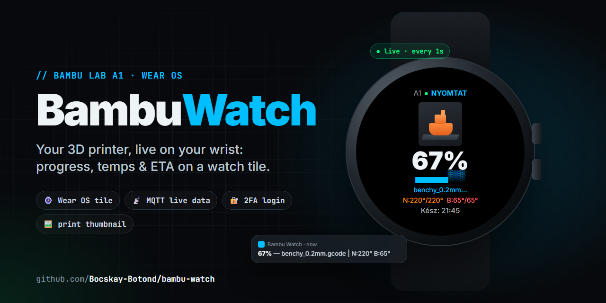

# ⌚ BambuWatch: Your 3D Printer, Live on Your Wrist

Stop walking to the printer every ten minutes. **BambuWatch** puts your **Bambu Lab A1**'s live status on a **Wear OS tile**: progress, nozzle and bed temperatures, the print's thumbnail and when it'll be done, refreshed every second.

[](#-installation)
[](#-installation)
[](mobile/src/main/java/com/bambu/watch)
[](LICENSE)

> ⚠️ **Unofficial.** Not affiliated with or endorsed by Bambu Lab. It uses the same cloud endpoints as Bambu Handy, which can change without notice.

---

## ⚡ What You Get

| On the watch tile ⌚ | On the phone 📱 |
|---|---|
| Printer name + online dot + state (printing / done / failed / paused / idle) | One-time login with email + password, with **2FA email code** support |
| **Print thumbnail** from Bambu Cloud | A foreground service that syncs every **1 second** |
| Big **progress %** with a 20-block bar | An ongoing notification: `67% — benchy.gcode \| N:220° B:65°` |
| Current file name | |
| **Nozzle & bed temperature** (current / target) | |
| **ETA** as a clock time (`Kész: 21:45`) | |

> 🇭🇺 The UI is currently in **Hungarian** (*NYOMTAT* = printing, *KÉSZ* = done, *Kész: 21:45* = done at 21:45). PRs adding English strings are very welcome.

---

## 🧠 How It Works

```
Bambu Cloud REST ──┐   (device, task, thumbnail)
                   ├─→ BambuSyncService ──→ Wearable Data Layer ──→ WearDataReceiver ──→ PrintTileService
Bambu Cloud MQTT ──┘   (live temps, %)       phone, every 1 s        /bambu/status          the tile
```

1. **`BambuApi`** logs in to `api.bambulab.com` (password, or the email code if 2FA is on), finds your printer and its current task.
2. **`BambuMqttClient`** connects to `us.mqtt.bambulab.com:8883` as `u_<uid>` with your token, subscribes to `device/<id>/report` and sends `pushall` to get the full state at once.
3. **`BambuSyncService`** merges the two (**MQTT wins** when it has a value, REST fills the gaps) and pushes a data item plus the thumbnail to the watch.
4. **`WearDataReceiver`** stores it, and **`PrintTileService`** draws the tile. It refreshes on every packet, and on its own every 5 seconds.

All UI is built in Kotlin code. There are no XML layouts.

```
BambuWatch/
├── mobile/   📱 phone app: login, sync service, REST + MQTT
│   └── src/main/java/com/bambu/watch/
│       ├── MainActivity.kt        login UI (email, password, 2FA code)
│       ├── BambuApi.kt            REST: login, device, tasks, thumbnail
│       ├── BambuMqttClient.kt     MQTT live data
│       └── BambuSyncService.kt    1 s loop → watch
└── wear/     ⌚ watch app
    └── src/main/java/com/bambu/watch/
        ├── WearDataReceiver.kt    Data Layer → SharedPreferences
        └── PrintTileService.kt    the tile
```

---

## 🚦 Prerequisites

- A **Bambu Lab** printer bound to your Bambu account (built and tested on an **A1**; other models that report over cloud MQTT should work)
- An **Android phone** (8.0+) paired with a **Wear OS 3+ watch** (built for a Galaxy Watch 7)
- **Android Studio** (or JDK 17 + Android SDK 35) to build

---

## 🔨 Installation

### ⚡ Option A: download the APKs (no build needed)

Grab both files from the **[latest release](https://github.com/Bocskay-Botond/bambu-watch/releases/latest)**:

| File | Install on |
|---|---|
| `bambu-watch-phone-v*.apk` | 📱 phone: open it and allow "install unknown apps" |
| `bambu-watch-wear-v*.apk` | ⌚ watch: `adb install bambu-watch-wear-v*.apk` (see step 3 below for connecting) |

Always install the phone and watch APK **from the same release**. They have to be signed with the same key to talk to each other. Then jump to [4. Use it](#4-use-it).

### 🛠️ Option B: build it yourself

### 1. Build

```bash
git clone https://github.com/Bocskay-Botond/bambu-watch.git
cd bambu-watch
./gradlew :mobile:assembleDebug :wear:assembleDebug     # Windows: gradlew.bat
```

Or open the folder in Android Studio and run each module.

### 2. Install on the phone (USB debugging on)

```bash
./gradlew :mobile:installDebug
```

### 3. Install on the watch (wireless debugging)

On the watch: **Settings → Developer options → Wireless debugging**, then pair once:

```bash
adb pair <watch-ip>:<pairing-port>        # enter the code shown on the watch
adb connect <watch-ip>:<port>
./gradlew :wear:installDebug
```

> Both modules **must share the same `applicationId`** (`com.bambu.watch`) and signing key, or the Data Layer won't deliver anything. Installing both debug builds from the same machine takes care of that.

### 4. Use it

1. Open **Bambu Watch** on the phone, log in with your Bambu account (enter the emailed code if asked).
2. On the watch, long-press the watch face → **Add tile** → **3D Print Status**.
3. Start a print. 🎉

---

## 🐛 Troubleshooting

| Problem | Fix |
|---|---|
| Tile shows `TÉTLEN` (idle) and 0% | Open the phone app: the status line shows the sync debug info. Check that the printer is online in Bambu Handy. |
| Login says `verifyCode` / nothing happens | Your account has 2FA: wait for the code field, enter the 6-digit code from the email. |
| Tile never updates | Phone and watch apps must have the same `applicationId` **and** signature, so install both from the same release (or build both on the same machine). Don't mix a release APK with your own build. |
| No temperatures | They come only from MQTT. Check the phone notification: `N:0° B:0°` means MQTT isn't connected yet (it retries every 5 s). |
| Battery drain on the phone | The service polls every second. Tap **SZINKRONIZÁLÁS LEÁLLÍTÁSA** (stop sync) in the app when you're not printing. |

---

## 🔒 Security & Known Limitations

Being upfront about what this is: a personal project that works well for me, not a polished product.

- **Your password is never stored.** The phone keeps only the Bambu access token, in app-private storage.
- 🔐 **TLS is fully verified** (since v1.0.1): the MQTT connection checks the broker's certificate against Android's system trust store **and** its hostname (`*.mqtt.bambulab.com`, issued by DigiCert).
- Only the **first printer** on the account is monitored.
- MQTT uses the **`us`** broker, which serves global accounts. China-region accounts would need `cn.mqtt.bambulab.com`.
- Polling every second is simple but not battery-optimal.

---

## 🗺️ Roadmap / Ideas

- [x] Verify the MQTT TLS certificate *(v1.0.1)*
- [ ] English UI strings (and auto language switch)
- [ ] Multiple printers, with a picker on the watch
- [ ] Watch **complication** (progress ring on the watch face)
- [ ] Vibrate on finish or failure
- [ ] Back off the polling rate when idle

---

## 🤝 Contributing

PRs welcome, especially for the roadmap items above. Fork, branch, and make sure `./gradlew assembleDebug` passes.

## 📄 License

[MIT](LICENSE). "Bambu Lab" is a trademark of its owner and is used here only to describe compatibility.

## 🙏 Acknowledgments

- The [OpenBambuAPI](https://github.com/Doridian/OpenBambuAPI) community for documenting the cloud and MQTT protocol
- Built with a lot of help from [Claude Code](https://claude.com/claude-code) 🤖

---

⭐ **If this saved you a trip to the printer, star the repo!**
